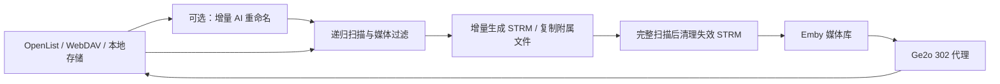
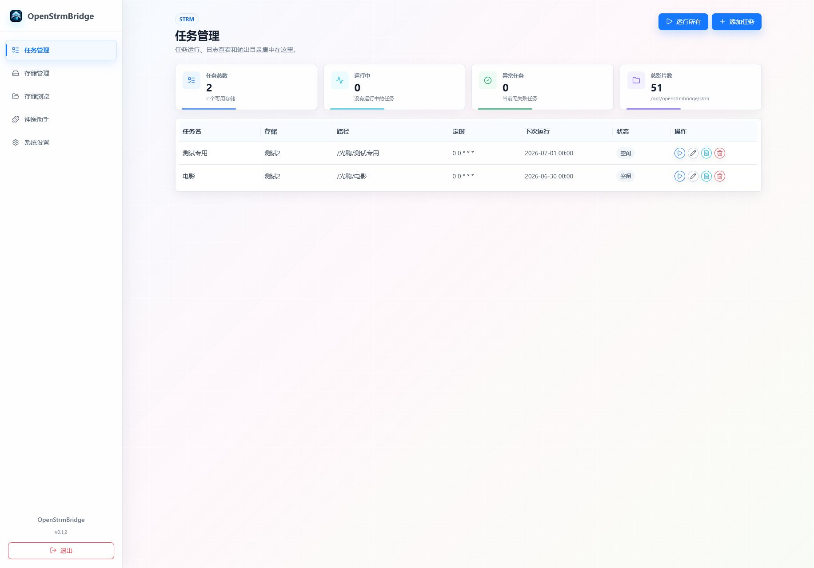
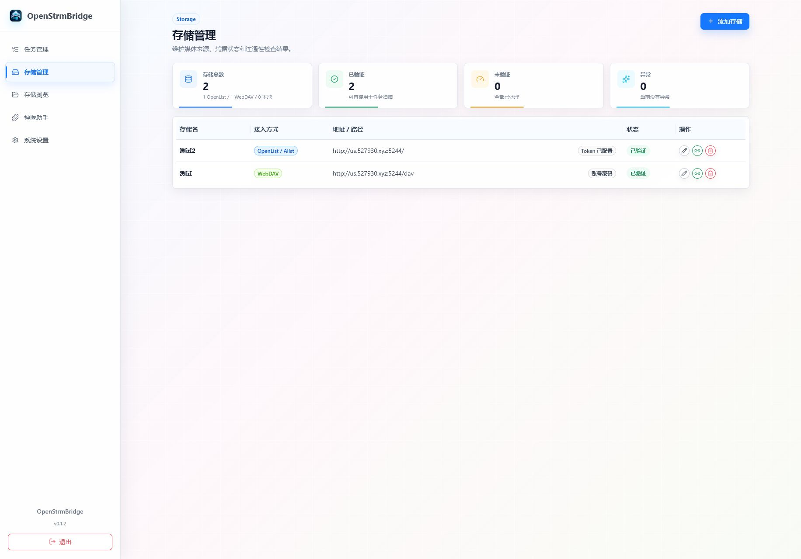
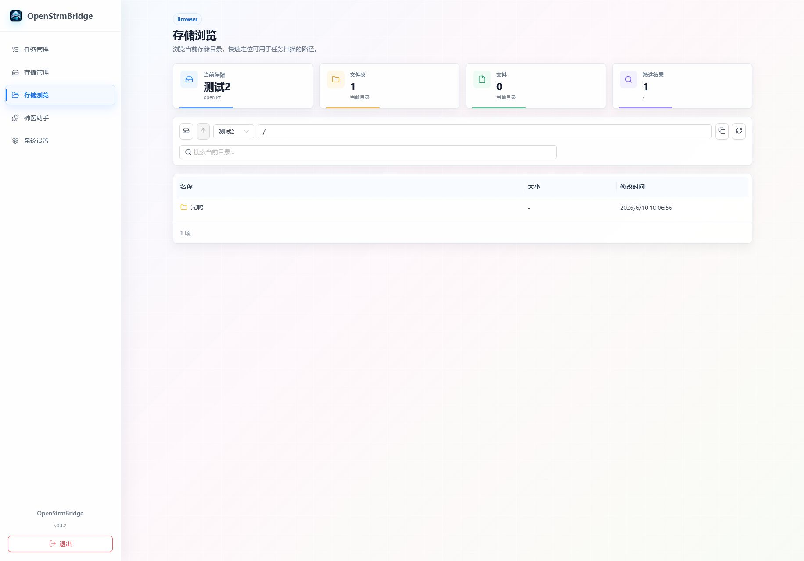
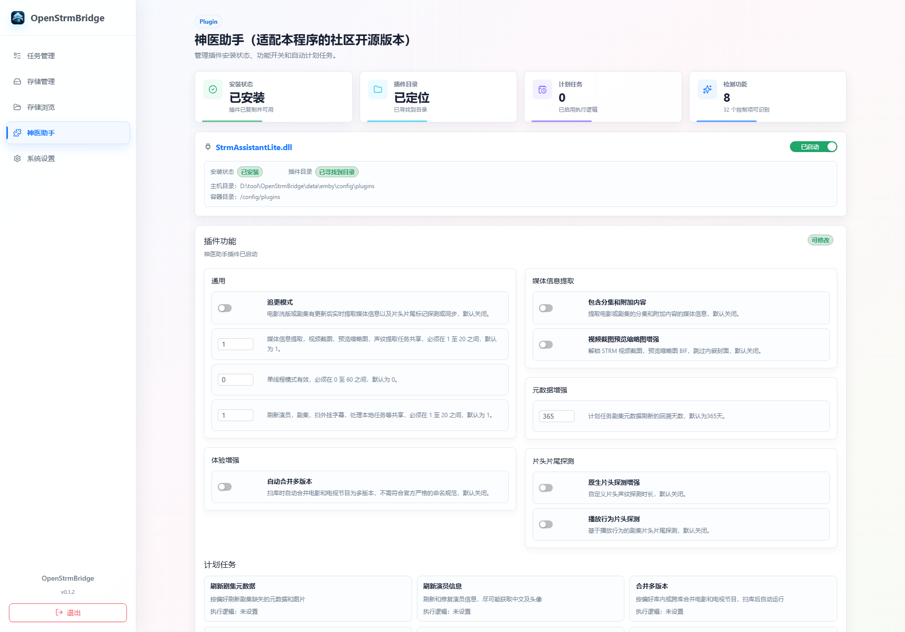
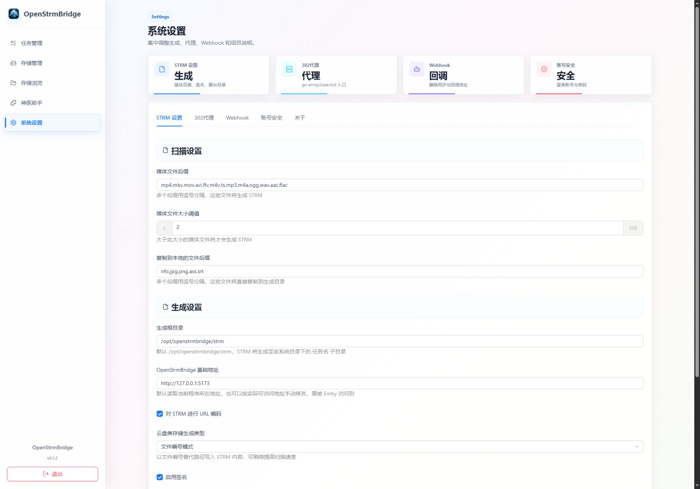
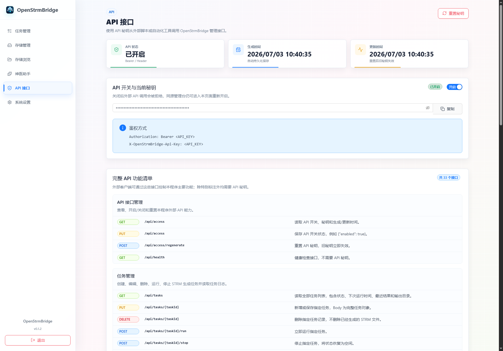

<p align="center">
  
</p>

<h1 align="center">OpenStrmBridge</h1>

<p align="center">
  面向家庭影音库的存储管理、AI 媒体整理、STRM 生成与 Emby 302 代理控制台。
</p>

<p align="center">
  <a href="https://github.com/ODJ0930/OpenStrmBridge/releases"></a>
  <a href="https://hub.docker.com/r/diead/openstrmbridge"></a>
  <a href="./LICENSE"></a>
  
  
</p>

---

OpenStrmBridge 将 OpenList / Alist、WebDAV、本地文件、AI 媒体重命名、STRM 任务、失效文件清理、Webhook 删除同步、Emby 302 代理与神医助手管理集中在一个管理台中。项目内置 `go-emby2openlist` 源码及预编译能力，并提供 Docker、Debian 一键脚本和五个平台的便携发行包。

## 目录

- [近期版本重点](#近期版本重点)
- [核心能力](#核心能力)
- [处理流程](#处理流程)
- [页面与功能](#页面与功能)
- [功能预览](#功能预览)
- [快速开始](#快速开始)
- [初次配置](#初次配置)
- [AI 自动重命名](#ai-自动重命名)
- [STRM 任务与安全清理](#strm-任务与安全清理)
- [302 代理与神医助手](#302-代理与神医助手)
- [API 与 Webhook](#api-与-webhook)
- [数据目录与环境变量](#数据目录与环境变量)
- [开发与发行](#开发与发行)

## 近期版本重点

| 版本              | 主要更新                                                                                                                                                          |
| ----------------- | ----------------------------------------------------------------------------------------------------------------------------------------------------------------- |
| `v0.1.8` 当前构建 | AI 重命名递归逻辑媒体分组；深层剧集容器与季目录识别；分类层级保留；托管任务、立即任务及 STRM 前重命名统一增量基线                                                 |
| `v0.1.7`          | Docker `amd64/arm64` 镜像；AI 重命名持久化增量基线；文件大小和修改时间变更检测；电影合集识别；AI 空元数据安全跳过；失效 STRM 索引与越界清理保护                   |
| `v0.1.6`          | AI 自动重命名设置页与独立任务管理；电影/电视剧 Emby 命名；一次性目录清单识别、逐项执行；生成 STRM 前可选增量 AI 整理；完整扫描后的失效 STRM 清理；Ge2o 发行包编译 |
| `v0.1.5`          | 兼容已存在的神医助手插件文件并完善安装状态识别                                                                                                                    |
| `v0.1.4`          | 改进神医助手配置同步反馈，配置文件写入成功时不再显示无效接口错误                                                                                                  |
| `v0.1.3`          | 外部 API 管理、API Key 鉴权、完整接口清单与神医助手参数同步                                                                                                       |
| `v0.1.2`          | 便携启动器支持 Docker 可访问地址，完善 Emby 授权、STRM 动态签名和神医助手任务控制                                                                                 |

## 核心能力

| 能力             | 说明                                                                                                                               |
| ---------------- | ---------------------------------------------------------------------------------------------------------------------------------- |
| 多存储接入       | 支持 OpenList / Alist、WebDAV、本地文件；保存凭据、根目录和 STRM 地址并进行连通性检查                                              |
| 目录浏览         | 在页面中选择存储、逐级浏览、搜索、刷新、复制路径；任务目录通过可视化选择器完成                                                     |
| AI 媒体整理      | OpenAI Chat Completions 兼容接口；模型探测和测速；可编辑提示词及请求参数；中英命名规则；电影/电视剧识别；可选 TMDB 校验            |
| AI 增量任务      | 首次建立目录指纹基线，之后只把新增或变化的视频目录交给 AI；文件名、路径、大小和修改时间参与变更判断；无变化时不调用 LLM            |
| Emby 标准结构    | 电视剧整理为 `剧名 (年份)/Season 01/剧名 - S01E01.ext`，电影整理为 `电影名 (年份)/电影名 (年份).ext`；正确区分电影合集和电视剧季集 |
| STRM 生成        | 媒体后缀、大小阈值、扫描线程、URL 编码、签名、编号/完整路径模式、附属文件复制、目录时间检查、增量生成和 OpenList 缓存预刷新        |
| 安全清理         | 仅在完整扫描成功后清理已失效 STRM；保护共享引用和任务边界；扫描失败或不完整时不执行破坏性清理                                      |
| 自动调度         | 使用 Crontab 表达式维护任务，支持立即运行、运行全部、停止、实时日志、最近结果和输出目录查看                                        |
| Emby 302 代理    | 内置 go-emby2openlist / Ge2o，自动生成配置并托管代理进程；OpenList 地址和 Token 复用已保存的存储配置                               |
| 神医助手         | 内置 `StrmAssistantLite.dll`，支持插件目录检测、安装/替换、参数开关、Emby API 任务触发、进度读取和按小时/STRM 完成后调度           |
| Webhook 删除同步 | 接收 Emby 媒体删除事件，可选同步删除远程存储中的源文件                                                                             |
| 外部 API         | 独立 API 开关和可重置 Key，支持 Bearer / Header 鉴权；覆盖任务、存储、设置、AI 重命名、插件、播放中转与 Webhook                    |
| 多种部署方式     | Docker Hub 多架构镜像、Docker Compose、Debian / Ubuntu 一键安装脚本、Windows / Linux / macOS 便携包和源码开发模式                  |

## 处理流程



AI 重命名和 STRM 生成是两个独立任务系统，也可以在 STRM 任务中开启“生成 STRM 前先执行 AI 重命名”，形成自动整理后再入库的流水线。

## 页面与功能

| 页面          | 主要用途                                                                                          |
| ------------- | ------------------------------------------------------------------------------------------------- |
| 任务管理      | 新增/编辑 STRM 任务、选择扫描目录、设置 Crontab 和增量选项、运行/停止任务、查看实时日志与输出目录 |
| 存储管理      | 添加 OpenList / Alist、WebDAV、本地存储，维护 Token/账号/根目录并检查连接和目录样本               |
| 存储浏览      | 浏览远端或本地文件，搜索当前目录并复制路径                                                        |
| AI 自动重命名 | 配置 AI Base URL、API Key、模型、自定义参数、提示词、命名规则、文件夹重建和 TMDB                  |
| AI 重命名任务 | 可视化选择媒体目录，保存可重复运行的整理任务，运行全部/停止并查看目录提交数、增量跳过数和逐项结果 |
| 神医助手      | 检测和安装内置 Emby 插件，管理插件功能、线程参数与计划任务                                        |
| API 接口      | 开启外部 API、复制/重置 API Key、查看全部端点和 curl 示例                                         |
| 系统设置      | STRM、302 代理、Emby API Key、Webhook、账号安全和项目信息                                         |

## 功能预览

| 任务管理                                          | 存储管理                                         |
| ------------------------------------------------- | ------------------------------------------------ |
|     |  |
| 存储浏览                                          | 神医助手                                         |
|   |  |
| 系统设置                                          | API 接口                                         |
|  |      |

## 快速开始

### Docker Compose（推荐）

镜像地址：[diead/openstrmbridge](https://hub.docker.com/r/diead/openstrmbridge)

```bash
git clone https://github.com/ODJ0930/OpenStrmBridge.git
cd OpenStrmBridge
docker compose up -d
```

默认使用 `diead/openstrmbridge:v0.1.7`，同时支持 `linux/amd64` 和 `linux/arm64`。

Compose 默认映射：

| 宿主机          | 容器        | 用途                         |
| --------------- | ----------- | ---------------------------- |
| `./docker-data` | `/app/data` | 设置、凭据、任务和增量状态   |
| `./docker-strm` | `/app/strm` | 生成的 STRM 和复制的附属文件 |
| `5174`          | `5174`      | 管理页面和后端 API           |
| `8097`          | `8097`      | Ge2o / Emby 302 代理         |

启动后访问：

```text
http://服务器IP:5174
```

直接使用 Docker：

```bash
mkdir -p openstrmbridge/data openstrmbridge/strm

docker run -d \
  --name openstrmbridge \
  --restart unless-stopped \
  -p 5174:5174 \
  -p 8097:8097 \
  -e TZ=Asia/Shanghai \
  -v "$(pwd)/openstrmbridge/data:/app/data" \
  -v "$(pwd)/openstrmbridge/strm:/app/strm" \
  diead/openstrmbridge:v0.1.7
```

使用本地文件存储时，额外挂载媒体目录：

```yaml
volumes:
  - /宿主机媒体目录:/media
```

然后在“存储管理”中选择本地路径 `/media`。如果 Emby 也运行在 Docker 中，应将 `docker-strm` 对应的宿主机目录挂载到 Emby 的 `/media/strm`。

更新镜像：

```bash
docker compose pull
docker compose up -d
```

### Debian / Ubuntu 一键脚本

```bash
curl -fsSL https://raw.githubusercontent.com/ODJ0930/OpenStrmBridge/main/scripts/openstrmbridge-manager.sh | sudo bash
```

或：

```bash
wget -qO- https://raw.githubusercontent.com/ODJ0930/OpenStrmBridge/main/scripts/openstrmbridge-manager.sh | sudo bash
```

菜单支持安装/重装、启动、停止、更新、修改端口、重置账号密码和完整卸载。安装时会自动选择对应 CPU 架构的 Release 便携包、创建 systemd 服务并保留运行数据。

### 便携发行包

在 [GitHub Releases](https://github.com/ODJ0930/OpenStrmBridge/releases) 下载对应平台：

| 发行包                | 平台                  |
| --------------------- | --------------------- |
| `windows-x64.zip`     | Windows x64           |
| `debian-x64.tar.gz`   | Debian / Ubuntu x64   |
| `debian-arm64.tar.gz` | Debian / Ubuntu ARM64 |
| `macos-x64.tar.gz`    | macOS Intel           |
| `macos-arm64.tar.gz`  | macOS Apple Silicon   |

便携包已包含前端、Node.js 运行时、OpenStrmBridge 后端、Ge2o 二进制和神医助手插件，不需要另外安装 Node.js、pnpm 或 Go。

### 源码运行

前置依赖：

- Node.js 20+
- pnpm 10+
- Go 1.22+（开发模式启动内置 Ge2o）

```bash
pnpm install
```

终端 1：

```bash
pnpm backend:dev
```

终端 2：

```bash
pnpm dev
```

| 服务                | 默认地址                |
| ------------------- | ----------------------- |
| Vite 前端开发服务器 | `http://127.0.0.1:5173` |
| OpenStrmBridge 后端 | `http://127.0.0.1:5174` |
| Ge2o 代理           | `http://127.0.0.1:8097` |

### 默认账号

```text
账号：admin
密码：openstrmbridge
```

首次登录后可在“系统设置 / 账号安全”修改。

## 初次配置

1. 在“存储管理”添加 OpenList / Alist、WebDAV 或本地存储，并执行连通性检查。
2. 在“系统设置 / STRM 设置”确认媒体后缀、大小阈值、生成根目录、线程数和签名方式。
3. 需要自动整理媒体时，在“AI 自动重命名”配置 OpenAI 兼容接口、模型、提示词和命名规则。
4. 在“AI 重命名任务”选择媒体目录并运行一次，确认日志中的识别、跳过和失败结果。
5. 在“任务管理”创建 STRM 任务；需要自动整理时开启“生成 STRM 前先执行 AI 重命名”。
6. 如需 302 播放，在“系统设置 / 302代理”填写 Emby 地址、挂载路径并启用代理。
7. 手动运行一次 STRM 任务确认输出；之后由后台按 Crontab 自动调度。

## AI 自动重命名

### 接口与自检

- 支持 OpenAI Chat Completions 兼容 Base URL。
- 支持调用 `/models` 探测可用模型，也可以手动输入模型名。
- AI 测试分别显示接口延迟、输出 Token 数和 Token/s。
- 支持额外 JSON 请求参数，例如 `model_reasoning_effort`、`service_tier`、`temperature` 等；`model`、`messages`、`stream`、`response_format` 等核心字段由后端控制，不能覆盖。
- API Key 和 TMDB Token 只保存在后端数据目录，前端重新读取时只返回“是否已配置”。
- JSON Mode 不兼容时自动回退到普通 JSON 提示；瞬时请求失败会进行有限重试。

自定义参数示例：

```json
{
  "model_reasoning_effort": "xhigh",
  "service_tier": "priority"
}
```

### 一次识别、逐项执行

任务先递归拉取目标目录并建立清单，再把本次需要处理的视频目录一次性提交给 LLM。模型返回结构化媒体语义后，后端生成实际名称和目标路径，并按顺序逐项修改，避免大量并发改名触发云盘接口限制。

遇到瞬时错误、结构化输出回退或请求重试时，单次任务可能产生额外模型请求；正常识别流程不会按每个文件单独调用 LLM。

### 增量识别

- 第一次运行建立全量基线。
- 后续运行根据文件路径、名称、大小和修改时间计算目录指纹。
- 只把新增或变化的顶层视频目录提交给 AI；未变化目录直接计入“增量跳过”。
- 没有变化时提交目录为 `0`，不会调用 LLM。
- 修改 AI 模型、提示词、命名方式、TMDB 或任务参数后，配置指纹变化，会重新建立基线。
- 部分成功任务也保存当前基线，避免无法识别项目在每次运行时重复消耗模型调用。
- 删除 AI 重命名任务时同步删除对应增量状态。

### 命名规则

支持四种标题顺序：

- `中文名 (English Title)`
- `English Title (中文名)`
- 仅中文名
- 仅英文名

Emby 电视剧结构：

```text
瑞克和莫蒂 (Rick and Morty) (2013)/
  Season 01/
    瑞克和莫蒂 (Rick and Morty) - S01E01.mkv
    瑞克和莫蒂 (Rick and Morty) - S01E01.zh-CN.srt
```

Emby 电影结构：

```text
泰坦尼克号 (Titanic) (1997)/
  泰坦尼克号 (Titanic) (1997).mkv
```

程序保留原始扩展名、多集编号、`v2` 和分段信息；移除网站广告、发布组、分辨率和编码噪声。字幕、NFO、海报等附属文件只在能够可靠关联视频时跟随处理。

电影合集会按每个视频独立识别电影标题和年份，不会仅因为目录中存在编号 `1-9` 就当成电视剧 `S01E01-S01E09`。只有明确存在 `SxxEyy`、季/集文字等电视剧证据时才生成季集编号。

### 路径安全

- AI 只能返回稳定条目 ID 和媒体语义，不能直接指定绝对路径。
- 实际路径由后端按固定模板生成并限制在任务根目录内。
- 不覆盖已有同名目标，不删除媒体文件，不修改媒体内容。
- 冲突、无法识别和重复季集会跳过并记录；单项失败不阻断其他独立项目。
- 默认只改名；开启“重建 Emby 标准文件夹结构”后才创建季目录、移动文件和合并分散季。
- OpenList 使用 `mkdir/rename/move`，WebDAV 使用 `MKCOL/MOVE` 且 `Overwrite: F`，本地存储执行根目录越界检查。

### TMDB 校验

TMDB 默认为关闭。启用后使用官方 **API Read Access Token**，默认语言为 `zh-CN`。只有出现唯一且可信的匹配时才覆盖标题、年份和季集信息；匹配不明确时保留 AI 结果并在任务日志中提示。

## STRM 任务与安全清理

每个任务包含存储、扫描路径、Crontab、输出目录和以下开关：

| 选项                 | 作用                                                                |
| -------------------- | ------------------------------------------------------------------- |
| 检查目录修改时间     | 目录时间未变化时减少不必要的深入扫描                                |
| 增量生成             | 已存在且仍有效的 STRM 不重复写入                                    |
| 生成前执行 AI 重命名 | 扫描前先运行同一路径的增量 AI 整理，再基于改名后的云盘目录生成 STRM |
| 预刷新 OpenList 缓存 | 扫描前请求 OpenList 更新目录缓存，仅对 OpenList / Alist 存储显示    |

任务运行时扫描到合格媒体会立即生成 STRM，不需要等待所有目录扫描完成。扫描线程数可以在系统设置中调整，低并发更适合接口限制严格的网盘。

失效清理遵循以下边界：

1. 仅完整扫描成功后比较本次结果和持久化 STRM 索引。
2. 云盘源文件改名或删除后，旧 STRM 会在成功扫描结束时清理。
3. 同一 STRM 被其他任务共享时只解除当前任务关联，不误删仍被引用的文件。
4. 索引路径越过任务输出目录、目标不是受管理的 STRM，或扫描失败/被限制时拒绝清理。
5. 清理过程记录删除、解除关联、共享、缺失、失败和残留目录数量，日志可在前端查看。

## 302 代理与神医助手

### Ge2o / go-emby2openlist

源码位置：

```text
vendor/go-emby2openlist
```

开发模式在没有预编译二进制时使用 `go run`；Docker 和便携发行包直接运行对应平台的 Ge2o 二进制。后端自动生成：

```text
data/go-emby2openlist/config.yml
data/go-emby2openlist/custom-css/openstrmbridge-emby-cleanup.css
data/go-emby2openlist/custom-js/openstrmbridge-emby-cleanup.js
```

代理设置包括启用状态、服务端口、Emby 服务地址、Emby 媒体挂载路径和 OpenList 存储。默认代理端口为 `8097`。

### 神医助手

内置插件：

```text
resources/emby-plugins/StrmAssistantLite.dll
```

神医助手页面可以：

- 自动检测宿主机或 Docker Emby 插件目录。
- 安装特调版插件；存在同名原版时要求确认后替换。
- 同步追更、媒体信息提取、片头探测、多版本合并和线程数等插件参数。
- 使用 Emby API Key 立即执行任务并查看运行进度。
- 按固定小时运行，或在 OpenStrmBridge STRM 任务完成后触发。

Docker 部署时如需写入宿主机 Emby 插件目录，应把该目录挂载进 OpenStrmBridge 容器，并通过 `OPENSTRMBRIDGE_EMBY_PLUGIN_DIR` 指定容器内路径。

## API 与 Webhook

在“API 接口”页面开启外部 API 并生成 Key。支持两种鉴权：

```http
Authorization: Bearer <API_KEY>
```

或：

```http
X-OpenStrmBridge-Api-Key: <API_KEY>
```

示例：

```bash
curl -H "Authorization: Bearer <API_KEY>" \
  "http://127.0.0.1:5174/api/tasks"
```

主要接口分组：

- API Key 管理与 `/api/health` 健康检查
- STRM 任务增删改、运行、停止和日志
- 存储管理、连接检查和目录浏览
- AI 模型探测、测速、TMDB 测试、即时任务和持久化任务管理
- STRM、302 代理、Emby、Webhook 和 AI 设置
- 神医助手检测、安装、参数同步和任务运行
- STRM 播放中转、OpenList 直链兑换和 Emby Webhook

全部端点和可复制 curl 示例以“API 接口”页面显示为准。

Webhook 地址在“系统设置 / Webhook”生成，URL 自带随机 Token。开启 Emby 删除同步后，收到支持的删除事件会尝试删除对应远程源文件，并在后端日志中记录结果。

## 数据目录与环境变量

### 目录结构

```text
src/                         React 管理台
server/                      Node.js 后端、AI 整理、STRM、调度与代理管理
vendor/go-emby2openlist/     内置 Ge2o 源码
resources/emby-plugins/      内置神医助手插件
scripts/                     一键管理和多平台打包脚本
data/                        运行配置、凭据、任务和增量状态
dist/                        前端生产构建
release/                     本地便携发行包输出
```

`data/` 包含存储 Token、AI Key、TMDB Token、账号配置、任务和索引，不提交到 Git。升级或重建容器时应保留该目录。

### 环境变量

| 变量                                        | 默认值                     | 说明                                          |
| ------------------------------------------- | -------------------------- | --------------------------------------------- |
| `OPENSTRMBRIDGE_BACKEND_HOST`               | `127.0.0.1`                | 后端监听地址；Docker 镜像内为 `0.0.0.0`       |
| `OPENSTRMBRIDGE_BACKEND_PORT`               | `5174`                     | 管理页面和 API 端口                           |
| `OPENSTRMBRIDGE_DATA_DIR`                   | `data`                     | 运行数据目录；Docker 镜像内为 `/app/data`     |
| `OPENSTRMBRIDGE_WEB_DIR`                    | `dist`                     | 前端静态文件目录                              |
| `OPENSTRMBRIDGE_RUNTIME_CONFIG_FILE`        | `data/runtime-config.json` | 前端运行时配置文件                            |
| `OPENSTRMBRIDGE_GE2O_SOURCE_DIR`            | `vendor/go-emby2openlist`  | Ge2o 源码目录                                 |
| `OPENSTRMBRIDGE_GE2O_BINARY`                | 自动检测                   | 预编译 Ge2o 二进制路径                        |
| `OPENSTRMBRIDGE_BACKEND_PUBLIC_URL`         | `http://127.0.0.1:5174`    | Ge2o 回调 OpenStrmBridge 直链兑换接口的地址   |
| `OPENSTRMBRIDGE_STRM_DIR`                   | `/opt/openstrmbridge/strm` | 默认 STRM 根目录；Docker 镜像内为 `/app/strm` |
| `OPENSTRMBRIDGE_EMBY_MOUNT_PATH`            | `/media/strm`              | Emby 看到的 STRM 根目录                       |
| `OPENSTRMBRIDGE_EMBY_PLUGIN_DIR`            | 自动探测                   | Emby 插件目录；Docker 中可显式挂载并设置      |
| `OPENSTRMBRIDGE_EMBY_CONTAINER_NAME`        | `openstrmbridge-emby`      | 自动检测或重启 Emby 时优先使用的容器名        |
| `OPENSTRMBRIDGE_TASK_SCHEDULER_INTERVAL_MS` | `60000`                    | 后台任务调度检查间隔，设为 `0` 可关闭         |
| `VITE_OPENSTRMBRIDGE_API_BASE_URL`          | `http://127.0.0.1:5174`    | 开发构建时的后端 API 地址                     |
| `VITE_OPENSTRMBRIDGE_LOGIN_USER`            | `admin`                    | 首次构建默认账号                              |
| `VITE_OPENSTRMBRIDGE_LOGIN_PASSWORD`        | `openstrmbridge`           | 首次构建默认密码                              |

## 开发与发行

### 技术栈

| 层级     | 技术                                                                               |
| -------- | ---------------------------------------------------------------------------------- |
| Frontend | Vite 8、React 19、TypeScript、Ant Design 5、React Router                           |
| Backend  | Node.js 原生 HTTP 服务                                                             |
| AI       | OpenAI Chat Completions 兼容接口、结构化 JSON、可选 TMDB                           |
| Proxy    | vendored go-emby2openlist；开发时源码启动，发行包和容器使用预编译 Go 二进制        |
| Tooling  | pnpm、Vitest、Testing Library、TypeScript、oxlint、ESLint、Prettier、Docker Buildx |

### 常用命令

```bash
pnpm dev              # 前端开发服务器
pnpm backend:dev      # 后端服务
pnpm test             # 单元和集成测试
pnpm typecheck        # TypeScript 检查
pnpm lint:fast        # oxlint 快速检查
pnpm lint             # ESLint 完整检查
pnpm format           # Prettier 格式检查
pnpm build            # 前端生产构建
pnpm package:current  # 当前平台便携包
pnpm package:all      # 全部预设平台便携包
```

### Docker 构建

本地单架构镜像：

```bash
docker build \
  --build-arg VERSION=v0.1.7 \
  -t diead/openstrmbridge:v0.1.7 .
```

发布 `amd64/arm64` 多架构镜像：

```bash
docker buildx build \
  --platform linux/amd64,linux/arm64 \
  --build-arg VERSION=v0.1.7 \
  -t diead/openstrmbridge:v0.1.7 \
  -t diead/openstrmbridge:latest \
  --push .
```

Dockerfile 使用多阶段构建：分别生成 OpenStrmBridge 前端、Ge2o Web、跨架构 Ge2o 二进制，最终镜像只保留 Node.js 运行环境、静态页面、后端脚本、Ge2o、Docker CLI 和神医助手插件。

### 便携包构建

```bash
pnpm package:current
pnpm package:all
```

输出到 `release/`，压缩包输出到 `release/artifacts/`。发布时同时生成并上传 `SHA256SUMS.txt`。

## 上游项目

- [go-emby2openlist](https://github.com/AmbitiousJun/go-emby2openlist)
- [OStrm](https://github.com/hienao/ostrm)
- [StrmAssistant](https://github.com/sjtuross/StrmAssistant)

感谢上游项目提供代理、STRM 和 Emby 插件能力。OpenStrmBridge 在其基础上整合存储、AI 整理、任务调度、部署和可视化管理体验。

## License

OpenStrmBridge 使用 [GNU General Public License v3.0 only](./LICENSE)。
